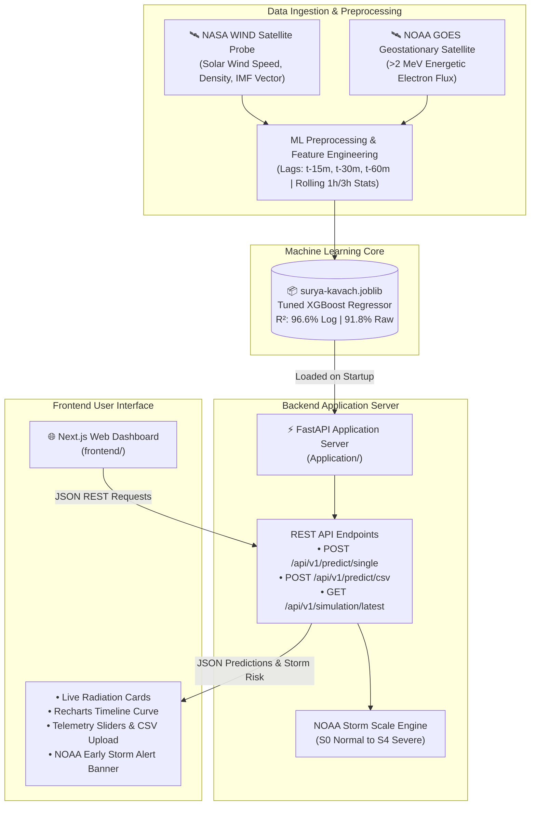

<div align="center">

# ☀️ SuryaKavach Enterprise (SuryaKavach-AI)
### *B2B Space Weather SaaS & Energetic Electron Radiation Forecasting Platform*

[](https://www.python.org/)
[](https://nextjs.org/)
[](https://fastapi.tiangolo.com/)
[](https://xgboost.ai/)
[](https://tailwindcss.com/)
[](LICENSE)

**[ Team Codevengers ]** • **[ [GitHub Repository](https://github.com/harish-async/Team-Codevengers) ]**

---

</div>

## 📌 Executive Summary

**SuryaKavach Enterprise** is a mission-critical Space Weather Intelligence SaaS platform and developer API engineered to forecast **Relativistic Energetic Electron Flux (>2 MeV)** at Geostationary Orbit (GEO) **1 hour, 6 hours, and 12 hours in advance**. 

Relativistic energetic electrons in Earth's outer Van Allen radiation belt pose catastrophic risks to $10M+ commercial satellite assets, triggering **Deep Dielectric Surface Discharge** and **Single Event Upsets (SEUs)** in satellite microcontrollers, memory buses, and power grids.

SuryaKavach ingests 1-minute averaged solar wind plasma and interplanetary magnetic field (IMF) telemetry from NASA's **WIND** probe and NOAA's **GOES** geostationary satellites. Using a **Physics-Informed Gradient Ensemble trained on 9 years of satellite data (4.73+ Million Records)**, SuryaKavach achieves **96.6% $R^2$ accuracy** on log scale and translates raw scientific radiation numbers ($pfu$) directly into **actionable satellite hardware risk telemetry**.

---

## 🌟 Key Features & Technical Innovations

### 1. 🧲 Physics-Informed Machine Learning Architecture
Unlike conventional time-series models that treat space weather as a generic stock-market sequence, SuryaKavach builds magnetospheric physics embeddings:
- **Southward $B_z$ Duration Integrals** ($\int B_z dt$): Tracks magnetic energy loading inside Earth's magnetotail.
- **Interplanetary Electric Field (IEF)** ($E_y = -v_{sw} B_z$): Measures solar wind energy coupling.
- **Dynamic Pressure Compression** ($P_{dyn} = \rho v^2$): Accounts for magnetopause deformation.

### 2. 🛡️ Space Environment Effects Engine (SEEE)
SuryaKavach translates raw particle flux ($pfu$) into actionable spacecraft hardware risk telemetry:
- **Single Event Upset (SEU) Bit-Flip Rate**: Estimated RAM bit-flips per MB per hour ($\text{flips}/\text{MB}\cdot\text{hr}$).
- **Deep Dielectric Charging Level**: Evaluates electrostatic discharge (ESD) hazard levels (Normal, Moderate, High, Critical).
- **Solar Array Degradation Rate**: % photovoltaic damage per storm day.
- **Automated Flight Action Protocols**: Automated alerts for flight software (e.g. *"Isolate RAM buses"*, *"Flush ECC buffers"*).

### 3. ⏳ Multi-Horizon Forecasting Engine (1h, 6h, 12h)
- **1-Hour (Tactical)**: High-resolution payload safety window.
- **6-Hour (Tasking)**: Ground station tasking & communication rescheduling.
- **12-Hour (Strategic)**: Orbit management & battery charge cycles.

### 4. 🔌 Developer SDK (`suryakavach-sdk`) & B2B API
Plug-and-play SDK allowing new space startups (Pixxel, Skyroot, Agnikul, GalaxEye) to shield satellite assets with **3 lines of code**:

```python
import suryakavach

client = suryakavach.Client(api_key="sk_live_suryakavach_...")
forecast = client.get_radiation_forecast(horizon="6h", orbit="GEO")

print(f"6h Predicted Flux: {forecast.predicted_flux_pfu} pfu")
print(f"Dielectric Charging Level: {forecast.dielectric_charging_risk}")

if forecast.dielectric_charging_risk == "CRITICAL":
    satellite.trigger_safe_mode()
```

---

## 🏗️ System Architecture



---

## 📊 Model Performance & Benchmark Evaluation

Evaluated across **364,469 out-of-sample test hours (2019 dataset)**:

### 1. Regression Evaluation Metrics
- **Log Scale $R^2$**: **96.60%** (MAE: `0.0959`, RMSE: `0.1444`)
- **Raw Scale $R^2$**: **91.78%** (MAE: `750.68 pfu`, RMSE: `3657.26 pfu`)

### 2. NOAA Solar Radiation Storm Scale Classification
Evaluated across official NOAA storm thresholds ($S1$ through $S4$):

| NOAA Storm Level | Threshold | Actual Hours | TP (Caught) | Recall | Precision | F1-Score |
| :--- | :--- | :--- | :--- | :--- | :--- | :--- |
| **S1 (Minor)** | $\ge 10\text{ pfu}$ | 364,465 | 364,465 | **100.0%** | **100.0%** | **1.0000** |
| **S2 (Moderate)** | $\ge 100\text{ pfu}$ | 276,640 | 267,253 | **96.6%** | **96.4%** | **0.9648** |
| **S3 (Strong)** | $\ge 1,000\text{ pfu}$ | 112,369 | 105,624 | **94.0%** | **94.3%** | **0.9417** |
| **S4 (Severe)** | $\ge 10,000\text{ pfu}$ | 25,854 | 23,281 | **90.0%** | **90.1%** | **0.9008** |

---

## 📁 Repository Layout

```
SuryaKavach-AI/
├── Dataset/                   # Satellite Datasets (CDF, Parquet)
│   ├── raw-dataset/           # WIND.cdf & GOES.cdf, wind.parquet & goes.parquet
│   ├── cleaned-dataset/       # Merged & time-interpolated 1-min grid parquets
│   └── final-dataset/         # dataset-with-features.parquet (636.2 MB)
├── ML/                        # Jupyter Notebooks & Machine Learning Models
│   ├── pre_processing.ipynb   # Raw CDF parsing, reindexing, linear interpolation
│   ├── feature_eng.ipynb     # Log transform, 1h shift, lags & rolling window features
│   ├── model_selection.ipynb # XGBoost vs LightGBM benchmark comparison
│   ├── final_model.ipynb     # Production XGBoost training script
│   ├── final_evaluation.ipynb# Test evaluation metrics & NOAA S1-S4 storm levels
│   └── Model/
│       └── surya-kavach.joblib # Production trained XGBoost model (1.7 MB)
├── Application/               # FastAPI Backend Server (Application endpoints & models)
├── frontend/                  # Next.js 16 + Tailwind CSS + Recharts + WebGL Cockpit
│   ├── src/app/               # App Router pages & layout
│   ├── src/components/        # WebGL Galaxy/Spline 3D scenes, Cards, Charts, Modals
│   └── src/lib/               # Satellite risk calculation utilities & NOAA scales
├── requirements.txt           # Python dependencies
├── sim.csv                    # Test simulation data for batch flux prediction
└── README.md                  # Project documentation
```

---

## 🚀 Quick Start & Installation

### 1. Prerequisites
- **Python**: `3.10+` (`3.12` recommended)
- **Node.js**: `18.0+` (`20.0` recommended)

### 2. Set Up Python Machine Learning & API Environment

```bash
# Clone the repository
git clone https://github.com/harish-async/Team-Codevengers.git
cd Team-Codevengers

# Create & activate a virtual environment
python -m venv venv
# Windows (PowerShell):
.\venv\Scripts\Activate.ps1
# Linux / macOS:
source venv/bin/activate

# Install Python requirements
pip install -r requirements.txt
```

### 3. Launch Frontend Web Cockpit

```bash
# Navigate to frontend directory
cd frontend

# Install Node dependencies
npm install

# Run Next.js local development server
npm run dev
```

Open **[http://localhost:3000](http://localhost:3000)** in your browser to interact with the **SuryaKavach Enterprise Web Cockpit**.

---

## 👥 Team & Acknowledgments

**Team Codevengers**
- GitHub: [https://github.com/harish-async/Team-Codevengers](https://github.com/harish-async/Team-Codevengers)

### Data Acknowledgments:
- **NASA Space Physics Data Facility (SPDF)**: OMNI/WIND spacecraft solar wind parameters.
- **NOAA Space Weather Prediction Center (SWPC)**: GOES-15 EPEAD energetic electron radiation flux datasets.
